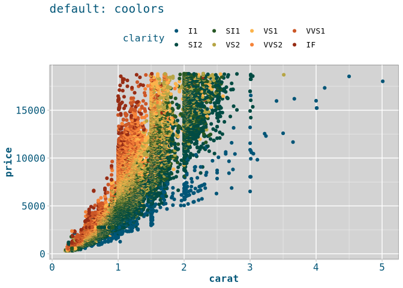
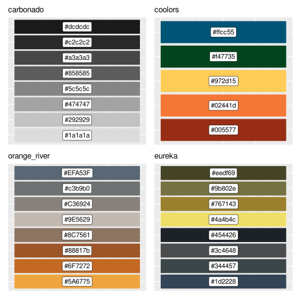

<!-- README.md is generated from README.Rmd. Please edit that file -->

# kimberlite

<!-- badges: start -->
<!-- badges: end -->

> “Kimberlite is an igneous rock, which sometimes contains diamonds. It
> is named after the town of Kimberley in South Africa, where the
> discovery of an 83.5-carat (16.70 g) diamond called the Star of South
> Africa in 1869 spawned a diamond rush and the digging of the open-pit
> mine called the Big Hole.” [Wikipedia:
> Kimberlite](https://en.wikipedia.org/wiki/Kimberlite)


Hypabyssal facies diamondiferous kimberlite at the Sloan Ranch,
Colorado.  
Source:
[diamondprospector.webs.com](https://diamondprospector.webs.com/kimberlite.htm)

This package is not more than a fork of
[ochRe](https://github.com/ropenscilabs/ochRe) package. The goal of
kimberlite is to create some named color palettes for ggplot2 and base R
graphics. As the name suggest palettes were inspired by kimberlites and
diamonds.

## Installation

You can install the released version of kimberlite from
[github](https://github.com/ZGFabian/kimberlite) with:

``` r
devtools::install_github("zgfabian/kimberlite")
```

## Example

This is a basic example which shows you how to solve a common problem:

``` r
library(kimberlite)
library(ggplot2)
## basic example code
ggplot(diamonds, aes(x=carat, y=price, color = clarity)) +
  geom_point() +
  scale_color_kimberlite() +
  theme_kimberlite() +
  labs(title = "default: coolors")
```



Currently for palettes are available via `kimberlite_pal()` function.


